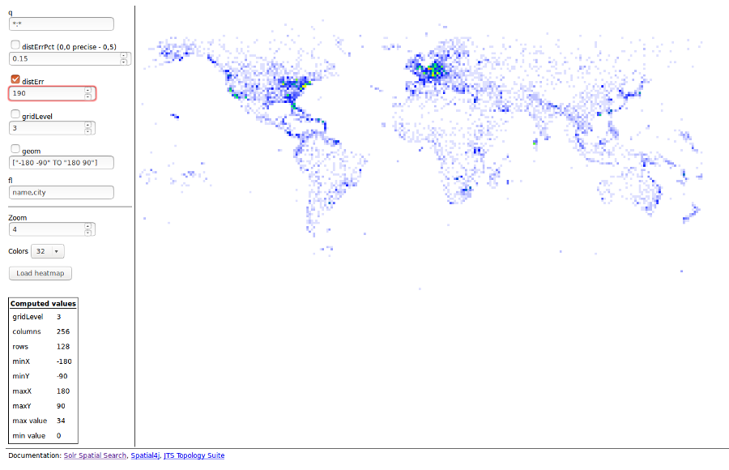

# Solr heatmap dashboard

A dashboard to experiment with Solr heatmap faceting parameters.

First, a screenshot:

## Setup

This dashboard uses a small local server to forward the requests to the Solr server, so first you have install a few dependencies to make the server work and then you have to tell it where your Solr server is.

The server is based on node.js. Go to the `server` directory and issue an `npm install` command. When it completes the server is ready.

Open the `config.yaml` file. It looks like this:

    server:
      port: 8888
      index: heatmap.html

    solr:
      base_url: "http://localhost:8983/solr/airports/select"
      rpt_field: location_rpt

You have to change the Solr base URL: it must be complete up to the name of the handler. In the `rpt_field` parameter you should put the name of the field containing your geographical data (in this example `location_rpt`). It must be an RPT type field.

If you like you can also change the port used by the server.

## Running

To start the server there's no `grunt`, `gulp`, `gasp`, :-) whatever: simply go to the server directory and write `node server.js` and it's up!

Then open your browser on `http://localhost:8888` (or the port you chose) and you should see the dashboard.

## Usage

The parameters in the dashboard are Solr's parameters, so you should refer to Solr's documentation for help, except for the last two that are used to modify how the cells are rendered:

- Zoom: width and height in pixels of each (square) cell;
- Colors: number of colors in the gradient, from 16 to 512.

After you change the parameters you have to press on the "Load heatmap" button to refresh the drawing.

Solr's parameters are sent only if the corresponding checkbox is selected.

The "Computed values" box is populated after the heatmap has been loaded to show you what Solr returns. It's interesting, for example, to see how the `gridLevel` changes depending on the `distErrPct` or `geom` parameters.

When you click on a cell a query is executed to retrieve, for each record belonging to that cell, the fields specified in the `fl` box: this box should contain a comma separated list of field names; if it's empty all the fields are retrieved. Then an alert is displayed with the data and the boundaries of the cell, that may be useful if you want to copy and paste them in the `geom` box to zoom into the cell.

### About colors

There's no classification algorithm behind color assignment: the cell value is mapped directly to the position in the gradient, so if the value exceeds the gradient it is "rounded up" `mod` length of the gradient. This is why in the "Computed values" is reported the max value found in the cells, so that you can choose an appropriate gradient if you don't want the values to exceed the gradient length.

## LICENSE

This software is under the GNU GENERAL PUBLIC LICENSE Version 3. For more information about using/distributing the software see [http://www.gnu.org/licenses/gpl.html](http://www.gnu.org/licenses/gpl.html).

THE SOFTWARE IS PROVIDED "AS IS" AND THE AUTHOR DISCLAIMS ALL WARRANTIES WITH REGARD TO THIS SOFTWARE INCLUDING ALL IMPLIED WARRANTIES OF MERCHANTABILITY AND FITNESS. IN NO EVENT SHALL THE AUTHOR BE LIABLE FOR ANY SPECIAL, DIRECT, INDIRECT, OR CONSEQUENTIAL DAMAGES OR ANY DAMAGES WHATSOEVER RESULTING FROM LOSS OF USE, DATA OR PROFITS, WHETHER IN AN ACTION OF CONTRACT, NEGLIGENCE OR OTHER TORTIOUS ACTION, ARISING OUT OF OR IN CONNECTION WITH THE USE OR PERFORMANCE OF THIS SOFTWARE.
